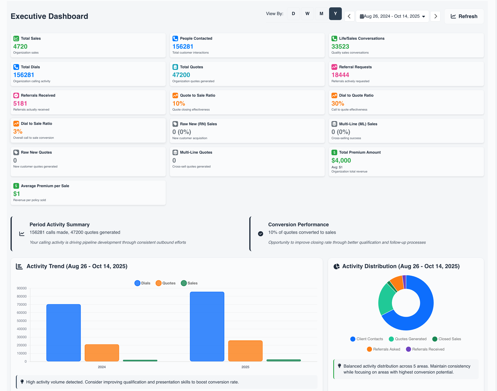
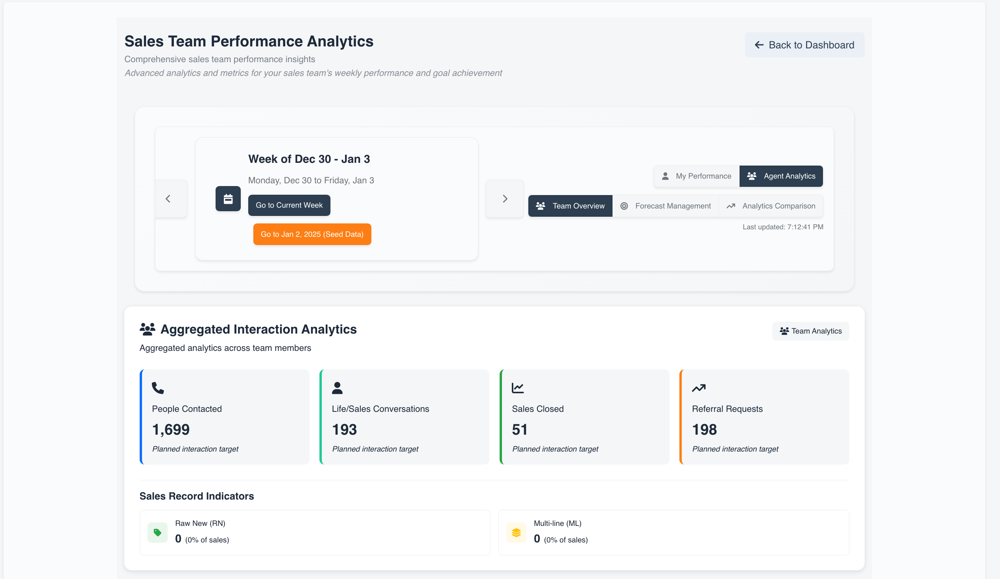
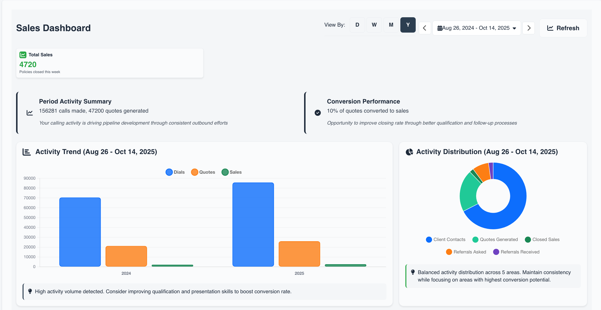

<div align="center">


# Sales Activity Manager

**Enterprise sales tracking platform that turns activity data into revenue insights.**


[](https://nextjs.org/)
[](https://www.typescriptlang.org/)
[](https://www.postgresql.org/)

[📖 User Guide](docs-public/AGENT_USER_GUIDE.md) • [🚀 Quick Start](#-quick-start) • [💻 For Developers](#-for-developers)

</div>

---

## 🎯 **Overview**

SAM transforms sales activity data into actionable intelligence. Built for enterprise teams who need to move beyond spreadsheets and static reports, it provides real-time visibility into performance metrics, pipeline health, and revenue forecasting.

### **Built for Three Audiences**

| Role | Value Proposition |
|------|-------------------|
| **Sales Teams** | Eliminate administrative overhead. Log activities in seconds, visualize progress against goals, and focus on what drives revenue. |
| **Team Leads** | Data-driven coaching at scale. Identify performance gaps, forecast accuracy, and optimize team productivity with real-time analytics. |
| **Executives** | Strategic visibility without micromanagement. Department-level KPIs, conversion metrics, and trend analysis for informed decision-making. |

---

## ✨ **Core Capabilities**

**Intelligence Layer**
- Real-time performance dashboards with predictive analytics
- Automated activity tracking with intelligent data aggregation
- Conversion funnel analysis and bottleneck identification

**Team Operations**
- Multi-level organizational hierarchies with role-based permissions
- Integrated task management with client relationship tracking
- Goal setting and progress monitoring with configurable KPIs

---

## 📊 **Platform Overview**

### Executive Dashboard
*High-level KPIs, conversion rates, and activity trends aggregated across your organization.*



### Team Performance Analytics
*Granular performance tracking with coaching insights and individual contributor metrics.*



### Task & Pipeline Management
*Unified view of activities, follow-ups, and pipeline stages with intelligent prioritization.*



---

## 🚀 **Quick Start**

```bash
# Clone and install
git clone https://github.com/sharedoxygen/sam-app.git
cd sam-app
npm install

# Configure environment
cp .env.example .env
# Edit .env with your database credentials

# Set up database
npx prisma generate
npx prisma db push
npm run db:seed

# Start dev server
npm run dev
```

Open [http://localhost:3000](http://localhost:3000) and login with `admin` / `adminpass`

---

## 💻 **For Developers**

### **Tech Stack**
- **Frontend:** Next.js 14 (App Router) + React 18 + TypeScript
- **Database:** PostgreSQL 15+ with Prisma ORM
- **Auth:** NextAuth.js with bcrypt
- **UI:** CSS Modules + Bootstrap + Chart.js

### **Key Commands**
```bash
npm run dev          # Development server
npm run build        # Production build
npm test             # Run tests
npm run db:seed      # Seed database
```

### **Project Structure**
```
src/
├── app/            # Next.js pages & API routes
├── components/     # React components
├── lib/            # Utilities
└── styles/         # CSS Modules

prisma/             # Database schema
```

### **API Endpoints**
```
/api/activities          # Activity CRUD
/api/tasks              # Task management
/api/weekly-activities  # Performance data
/api/users              # User management
```

---

## 📖 **Documentation**

- [📋 Complete User Guide](docs-public/AGENT_USER_GUIDE.md) — For sales agents and team leads
- [⚙️ Environment Setup](#-quick-start) — Getting started guide
- [🗄️ Database Commands](#-for-developers) — Database management

---

## 🚀 **Deployment**

### **Vercel (Recommended)**
```bash
vercel
```

### **Docker**
```bash
docker build -t sam .
docker run -p 3000:3000 --env-file .env sam
```

### **Production**
```bash
npm run build
npm start
```

---

## 📄 **License**

MIT License - Contact [Shared Oxygen, LLC](https://sharedoxygen.com) for licensing details.

---

<div align="center">

**[Shared Oxygen, LLC](https://sharedoxygen.com)**

[🚀 Get Started](#-quick-start) • [📖 Documentation](docs-public/AGENT_USER_GUIDE.md) • [🐛 Report Issues](https://github.com/sharedoxygen/sam-app/issues)

</div>
